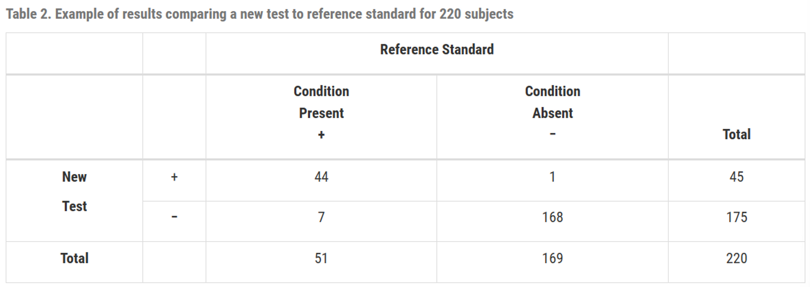
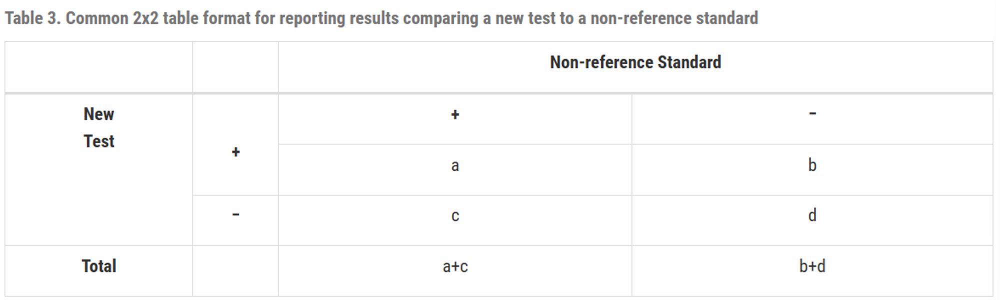
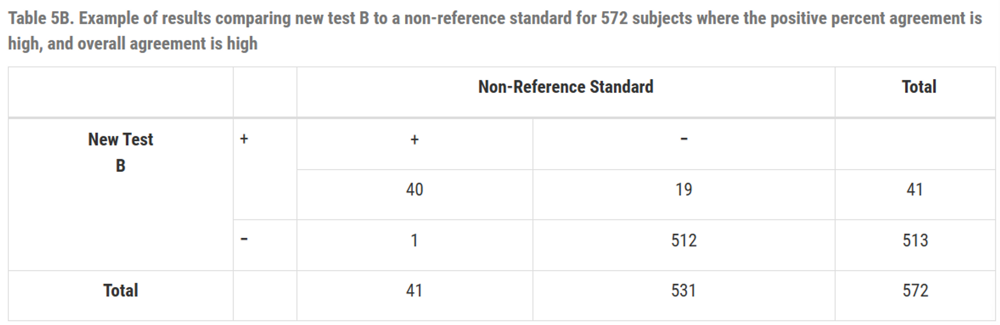
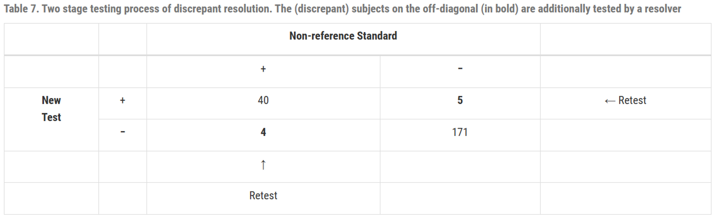
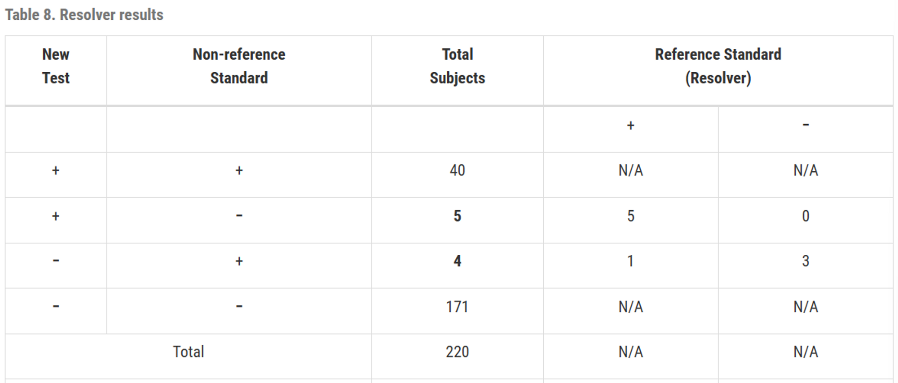
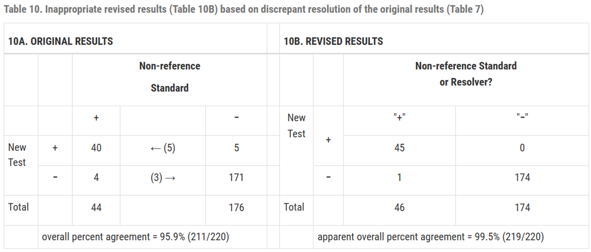

# 진단 검사 평가 연구 결과 보고에 대한 통계적 지침 (FDA) Part 2

## 5. 권장 보고 사항

진단 검사를 평가하는 연구에서는 다음 원칙에 따라 결과를 투명하게 보고해야 합니다.

### (1) 연구 맥락 보고 (Reporting the context of the study)
민감도와 특이도는 연구 모집단 및 설계의 맥락에 따라 달라질 수 있으므로, 다음 정보를 포함해야 합니다.
- **의도된 사용군 (Intended Use Population):** 제품의 실제 타겟이 되는 대상군
- **연구 집단 (Study Population):** 실제 연구에 참여한 피험자 특성
- **참조 표준 (Reference Standard):** 사용된 기준점의 정의 및 선택 근거와 한계점

### (2) 사용 조건 정의 (Defining the conditions of use)
- 수행자의 숙련도 및 경험 (Operator Experience)
- 실험 환경 및 설비 (Test Setting)
- 품질 관리 절차 (Controls Applied) 및 표본 승인 기준

### (3) 비교 결과 및 방법 설명
- 피험자 모집 절차 및 인구통계학적 정보
- 포함 및 제외 기준 (Inclusion/Exclusion Criteria)
- 표본 수집, 보관 및 처리 절차

### (4) 연구 결과 보고
- 임상 현장 및 검사 사이트별 결과
- 하위 그룹별 분석 결과
- **보고 형식:** 2x2 분할표, 정확도/일치도 측정치 및 95% 신뢰구간 (CI)
- **양적 결과 기반 질적 검사:** 히스토그램 및 ROC 커브 포함

---

## 6. 통계적으로 부적절한 관행

FDA는 진단 검사 평가 시 다음 네 가지 관행을 피할 것을 강력히 권고합니다.

### (1) 비-참조 표준 비교 시 '민감도/특이도' 용어 사용 금지
참조 표준이 아닌 기존 검사법과 비교할 때는 '민감도'와 '특이도' 대신 **'양성 퍼센트 일치도(PPA)'**와 **'음성 퍼센트 일치도(NPA)'**라는 용어를 사용해야 합니다.

### (2) 모호한 결과(Equivocal Results)의 임의 제거 금지
모호한 결과를 분석에서 제외하면 편향된 추정치가 발생할 수 있습니다. 모호한 결과를 양성으로 처리한 경우와 음성으로 처리한 경우를 모두 보고하는 것이 좋습니다.

### (3) 불일치 해결(Discrepant Resolution) 기반 데이터 수정 금지
두 검사법이 일치하지 않을 때 제3의 검사법(Resolver)을 써서 결과를 수정하는 방식은 과학적으로 타당하지 않으며, 결과가 과도하게 낙관적으로 보일 수 있습니다.

### (4) 평가 대상 검사가 포함된 알고리즘과 비교 금지
새로운 검사의 결과가 이미 포함된 진단 알고리즘의 결과와 해당 검사를 비교하는 것은 일치도가 부당하게 높게 나타나는 문제를 야기합니다.

---

## 7. 부록: 통계 계산 방법

### (1) 민감도와 특이도 산출 (참조 표준 사용 시)

| | 질병 있음 (Ref+) | 질병 없음 (Ref-) |
| :---: | :---: | :---: |
| **새 검사 양성** | TP (진양성) | FP (위양성) |
| **새 검사 음성** | FN (위음성) | TN (진음성) |

- **민감도:** $\frac{TP}{TP + FN}$
- **특이도:** $\frac{TN}{FP + TN}$

### (2) 일치도 산출 (비-참조 표준 사용 시)

| | 비-참조 표준 양성 | 비-참조 표준 음성 |
| :---: | :---: | :---: |
| **새 검사 양성** | a | b |
| **새 검사 음성** | c | d |

- **양성 퍼센트 일치도 (PPA):** $\frac{a}{a+c}$
- **음성 퍼센트 일치도 (NPA):** $\frac{d}{b+d}$
- **전체 퍼센트 일치도 (OPA):** $\frac{a+d}{a+b+c+d}$

#### 일치도의 한계 (예시)
일치도 수치만으로는 실제 성능을 완벽히 이해할 수 없습니다.

*(위 표에서 분모 값 수정이 필요할 수 있습니다: 41 → 59)*

### (3) 불일치 해결(Discrepant Resolution)의 문제점

불일치 해결 방식은 다음과 같은 단계를 거치지만, 결과의 신뢰도를 떨어뜨릴 수 있습니다.

1.  새 검사와 기존 검사 비교 후 불일치 발생 확인
2.  제3의 검사(Resolver)로 재검사
3.  기존 검사 결과를 Resolver의 결과로 수정하여 2x2 표 재작성 (비권장)

**결론:** 불일치 해결 방식을 통해 원래의 결과표를 수정하는 것은 부적절하며, 모든 데이터는 투명하게 공개되어야 합니다.
