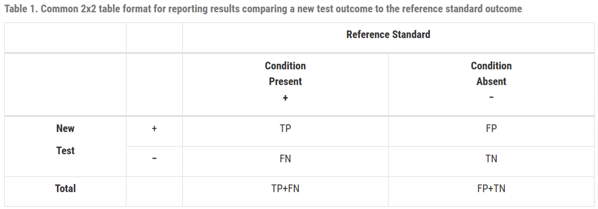
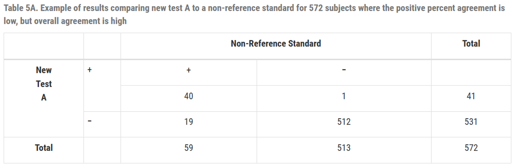

FDA는 진단 검사 평가 시 부적절한 통계 관행을 피하고 모든 데이터를 투명하게 공개할 것을 강력히 권고합니다 [@fda2007diagnostic].

## 1. 지침 기반 권장 보고 사항

진단 검사를 평가하는 연구에서는 다음 원칠에 근거하여 결과를 투명하게 보고해야 합니다.

### (1) 연구 맥락 보고 (Reporting Study Context)

민감도와 특이도는 연구 모집단 및 설계의 맥락에 따라 달라질 수 있습니다.

-   **의도된 사용군 (Intended Use Population):** 실제 제품의 타겟이 되는 대상 집단.
-   **연구 집단 (Study Population):** 연구에 참여한 피험자의 주된 특성.
-   **참조 표준 (Reference Standard):** 기준점의 정의 및 선택 근거와 한계점 기술.

### (2) 사용 조건 및 환경 정의

-   수행자의 숙련도 및 경험 (Operator Experience)
-   실제 실험 환경 및 기기 관리 상태 (Test Setting)
-   품질 관리(QC) 절차 및 표본 승인 기준

---

## 2. 지양해야 할 통계적 관행 (Improper Practices)

### (1) 부적절한 용어 사용

비-참조 표준(Non-reference Standard)과 비교할 경우 '민감도/특이도' 대신 **'양성/음성 퍼센트 일치도(PPA/NPA)'**를 사용해야 합니다.

### (2) 불일치 해결(Discrepant Resolution)을 통한 데이터 수정

두 검사법이 일치하지 않을 때 제3의 검사법(Resolver)을 사용하여 기존 결과를 수정하는 행위는 과학적 타당성이 부족하며 연구 결과를 지나치게 낙관적으로 만들 수 있습니다.

### (3) 모호한 결과(Equivocal Results)의 편의적 분석

미확정된 결과를 단순히 분석에서 제외하면 성능 데이터가 편향되므로, 이를 양성이나 음성 중 하나로 간주했을 때의 각각의 영향(Worst-case 등)을 함께 보고해야 합니다.

---

## 3. 요약: 통계 계산 방법

진단 성능 지표는 2x2 분할표를 기본으로 하며, 반드시 95% 신뢰구간(CI)과 함께 제시되어야 합니다.

### (1) 참조 표준 기반 산출

-   **민감도:** $\frac{TP}{TP + FN}$
-   **특이도:** $\frac{TN}{FP + TN}$

### (2) 비-참조 표준 기반 산출 (일치도)

-   **양성 퍼센트 일치도 (PPA):** $\frac{a}{a+c}$
-   **음성 퍼센트 일치도 (NPA):** $\frac{d}{b+d}$
-   **전체 퍼센트 일치도 (OPA):** $\frac{a+d}{a+b+c+d}$

## 4. 결론

진단 기기 승인을 위한 핵심은 모든 결과 데이터를 투명하게 공개하고, 적절한 통계 지표와 신뢰구간을 통해 그 성능을 입증하는 데 있습니다.
