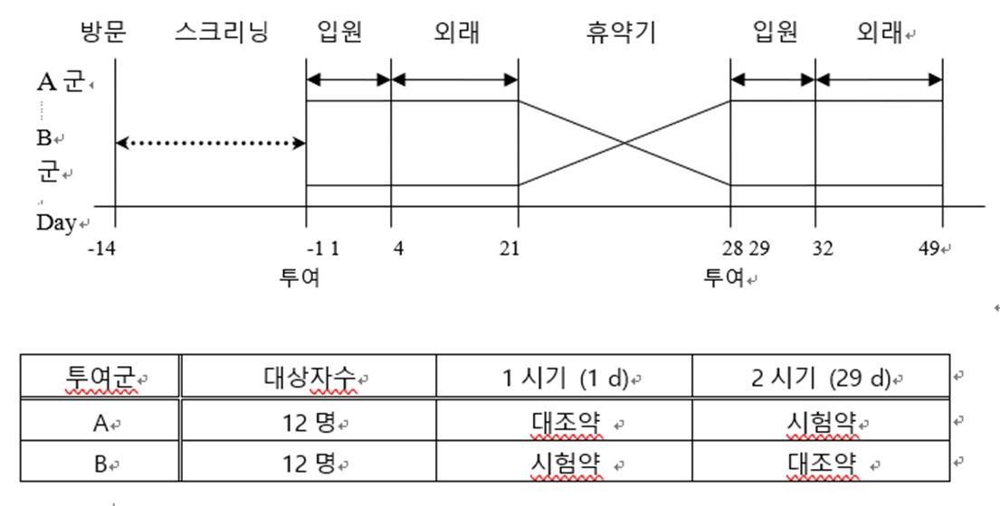
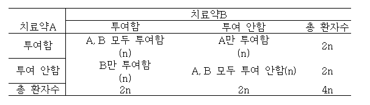

# 임상시험의 통계적 원칙 (E9) Part 1

## 1. 서론 (Introduction)

### A. 배경 및 목적

본 문서는 의뢰자(Sponsor)에게 임상시험의 설계, 분석 및 평가 전반에 걸친 통계적 지침을 제공하는 것을 목적으로 합니다.

### B. 범위 및 방향

1. 본 지침은 구체적인 통계 절차보다는 통계적 원칙(Statistical Principles)에 중점을 둡니다.
2. 임상시험의 모든 통계적 업무는 통계 전문가(Statistician)의 책임하에 수행되어야 하며, 해당 전문가는 본 원칙을 준수할 수 있는 충분한 교육과 경험을 갖추어야 합니다.
3. 임상시험 계획서(Protocol) 및 개정안 작성 시, 통계 분석 부분이 적절히 반영되었는지 통계 전문가의 확인이 반드시 필요합니다.
4. 본 문서는 주로 확증적 임상시험(Confirmatory Trial)을 다룹니다.
5. 핵심 원칙은 편향(Bias)의 최소화와 정밀도(Precision)의 극대화입니다.
6. 편향은 타당한 결론 도출을 방해하는 가장 큰 요인이므로 이를 최소화하는 것이 무엇보다 중요합니다.
7. 주로 빈도주의 방법론(Frequentist Methods)을 설명하지만, 상황에 따라 베이지안(Bayesian) 방법론도 고려될 수 있습니다.

## 2. 임상 개발 전반에 대한 고려사항

### A. 임상시험의 맥락

1. **개발 계획 (Development Plan):** 신약 개발의 목표는 적절한 용량(Dose)과 투여 기간(Schedule) 내에서 안전성과 유효성을 동시에 입증하고, 수용 가능한 위험-이익(Risk-Benefit) 균형을 찾는 것입니다.
2. **확증적 임상시험 (Confirmatory Trial):** 사전에 가설을 설정하고 이를 평가하는 통제된 시험입니다. 통계적 유의성뿐만 아니라 임상적 유의성(Clinical Significance) 확보가 중요하며, 계획서와 표준 작업 지침서(SOP)를 엄격히 준수해야 합니다.
3. **탐색적 임상시험 (Exploratory Trial):** 가설 입증보다는 새로운 사실을 발견하고 확증적 시험을 위한 근거를 마련하는 데 초점을 둡니다.

### B. 임상시험의 범위

1. **대상자 집단 (Population):** 적절한 선정 및 제외 기준을 통해 목표 모집단을 설정하는 것이 중요합니다. 너무 좁은 집단만 선택하면 결과의 일반화가 어려울 수 있습니다.
2. **일차 및 이차 변수 (Primary and Secondary Variables):**
    - **일차 변수 (Primary Variable):** 시험 목적과 가장 직결되는 변수로, 표본 크기 산정의 근거가 됩니다. 눈가림 해제 후 임의로 변경할 수 없습니다.
    - **이차 변수 (Secondary Variable):** 일차 목적을 보조하는 변수입니다.
3. **복합 변수 (Composite Variables):** 여러 측정 지표를 단일 지표로 통합한 변수입니다. 다중성 문제 해결에 유용하지만, 구성 요소 각각에 대한 분석도 병행하는 것이 바람직합니다.
4. **종합 평가 변수 (Global Assessment Variables):** 전반적인 유효성이나 안전성을 측정하지만, 상세한 효과 차이를 가릴 수 있어 일차 변수로는 권장되지 않습니다.
5. **다중 일차 변수 (Multiple Primary Variables):** 두 개 이상의 일차 변수를 사용할 경우, 가설 검정 방법과 다중성 조절(Type 1 Error 제어) 방안을 명확히 기술해야 합니다.
6. **대리 변수 (Surrogate Variables):** 실제 임상적 유익성을 직접 관찰하기 어려울 때 사용하는 간접 지표입니다. 실제 임상 결과와의 상관관계가 충분히 입증되어야 합니다.
7. **범주화 변수 (Categorized Variables):** 연속형 변수를 '성공/실패' 등으로 범주화하는 것입니다. 임상적 의미가 명확해야 하며 계획서에 사전에 정의되어야 합니다.

### C. 편향 방지를 위한 설계 기법

편향을 줄이는 가장 중요한 기법은 **눈가림(Blinding)**과 **무작위 배정(Randomization)**입니다.

1. **눈가림 (Blinding):** 피험자나 연구자가 배정된 군을 알게 됨으로써 발생하는 편향을 방지합니다.
    - **이중 눈가림 (Double Blind):** 피험자, 연구자, 의뢰자, 평가자 모두 배정 결과를 모르게 하는 가장 이상적인 방법입니다.
    - 데이터 정리(Data Cleaning)가 완료되고 눈가림 해제(Unblinding) 전까지 엄격히 유지되어야 합니다.
2. **무작위 배정 (Randomization):** 대상자를 치료군에 무작위로 할당하여 각 군의 비교 가능성을 높입니다.
    - 주로 **블록 무작위 배정 (Block Randomization)**을 사용하며, 주요 예후 인자에 따른 **층화(Stratification)**를 병행할 수 있습니다.

## 3. 임상시험 설계 시 고려사항

### A. 설계 구성 (Design Configuration)

1. **평행군 설계 (Parallel Group Design):** 가장 일반적인 설계로, 대상자가 무작위로 한 치료군에 배정되어 시험 종료 시까지 해당 치료를 받는 방식입니다.
    
2. **교차 설계 (Crossover Design):** 각 대상자가 순차적으로 여러 치료를 받는 방식입니다. 대상자 자신이 대조군 역할을 하므로 표본 크기를 줄일 수 있으나, 이전 치료의 효과가 남는 **잔류 효과(Carryover Effect)**를 방지하기 위한 휴약기(Washout Period) 설정이 중요합니다.
    
3. **요인 설계 (Factorial Design):** 두 개 이상의 치료 조합을 동시에 평가하여 치료 간의 상호작용(Interaction)을 확인하는 데 사용됩니다.
    

### B. 다기관 임상시험 (Multicenter Trials)

짧은 기간 내 대상자 모집이 가능하고 결과의 일반화에 유리하지만, 기관 간의 이질성을 관리해야 합니다.

### C. 비교 유형

1. **우월성 시험 (Superiority Trial):** 시험약이 대조군(위약 또는 활성대조약)보다 우수함을 입증합니다.
2. **동등성 및 비열등성 시험 (Equivalence and Non-inferiority Trial):** 시험약이 대조약과 효과 차이가 없거나, 허용 범위 내에서 나쁘지 않음을 입증합니다.
3. **용량-반응 시험 (Dose-Response Trial):** 약물 용량에 따른 유효성 및 안전성 변화를 확인하여 최적 용량을 찾습니다.

### D. 표본 크기 (Sample Size)

- 표본 크기는 일차 목적에 근거하여 통계적으로 산출되어야 합니다.
- 유의수준(Type 1 Error), 검정력(Power), 기대 효과 크기, 탈락률 등을 고려하여 계획서에 명시해야 합니다.

## 4. 임상시험 수행 중 고려사항

1. **중간 분석 (Interim Analysis):** 시험 완료 전 치료 효과를 비교하는 분석입니다. 사전에 계획되어야 하며, 반복적 분석으로 인한 제1종 오류 증가를 제어해야 합니다.
2. **독립적 데이터 모니터링 위원회 (IDMC):** 의뢰자와 독립적으로 안전성 및 유효성 데이터를 모니터링하여 시험의 지속 여부를 권고하는 기구입니다.
