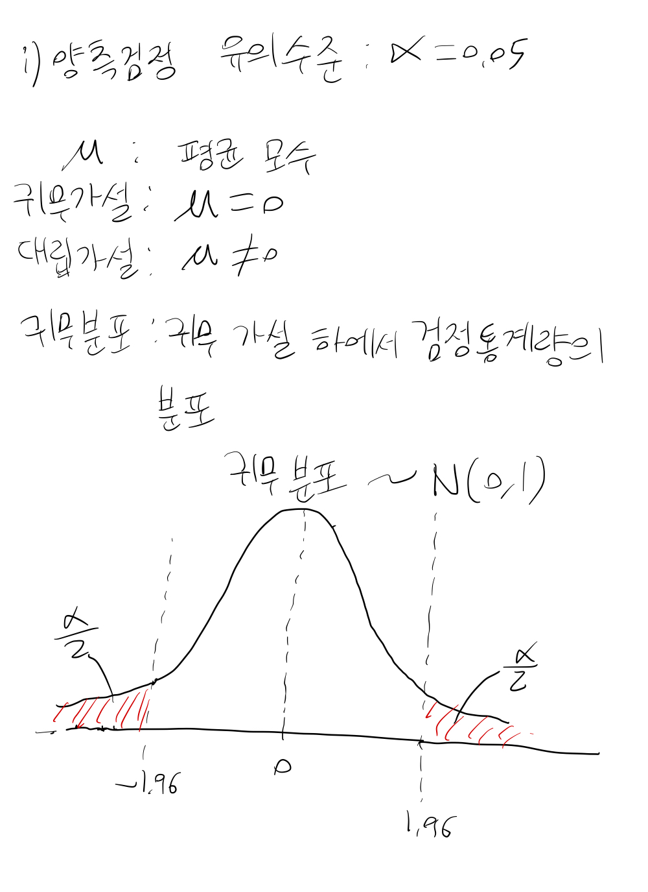
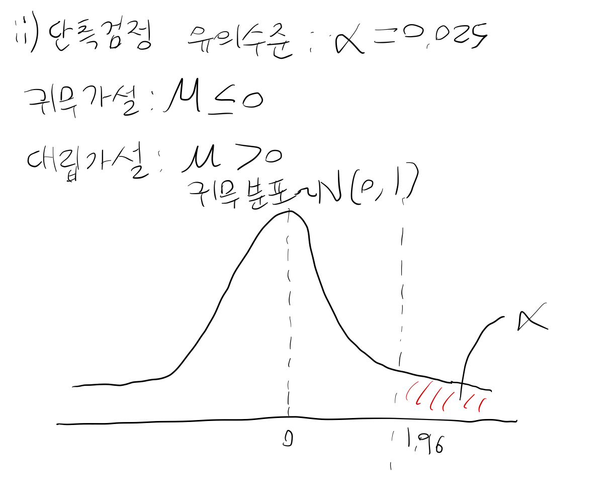
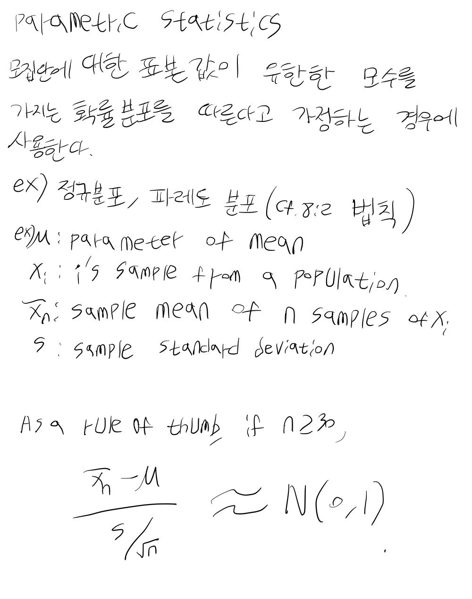
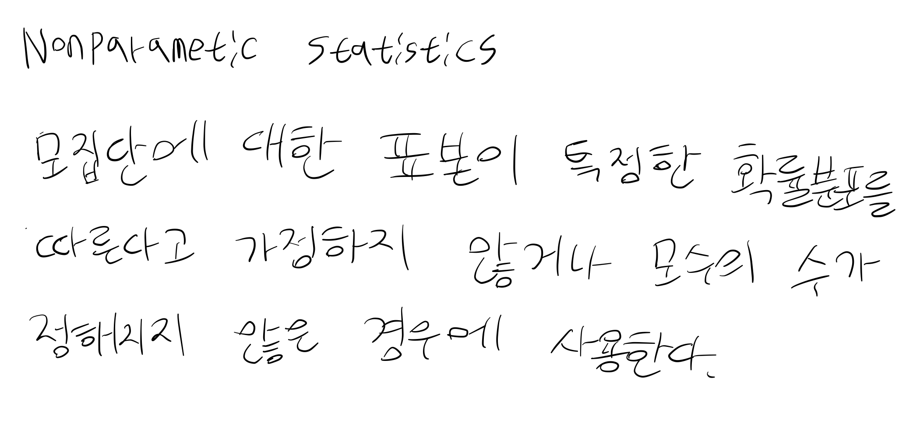

# 임상시험의 통계적 원칙 (E9) Part 2

## 5. 데이터 분석 고려사항

통계 분석 계획서(Statistical Analysis Plan, SAP)는 임상시험 계획서가 완성된 직후 작성되어야 하며, 데이터의 눈가림 리뷰(Blind Review)가 완료된 시점에 다시 한번 검토되어야 합니다.

### 분석 대상 집단 (Analysis Sets)

원칙적으로 모든 피험자의 데이터를 확보하는 것이 목표이지만, 실제로는 중도 탈락이나 결측치 발생이 불가피합니다. 이러한 상황에서 발생할 수 있는 편향(Bias)을 최소화하고 제1종 오류를 통제하기 위한 대책을 수립해야 합니다.

#### 1. ITT 분석군 (Full Analysis Set, FAS)
- **ITT 원칙(Intention-to-Treat Principle):** 무작위 배정된 모든 피험자를 분석에 포함하는 원칙입니다. 피험자가 계획을 엄격히 준수하지 않았더라도 배정된 군의 일원으로 분석합니다.
- 예외적으로 데이터 분석 전 객관적인 기준에 따라 일부 데이터를 제외할 수 있으나, 이는 충분히 정당화되어야 합니다.

#### 2. 계획서 준수 분석군 (Per Protocol Set, PPS)
- 계획서를 충실히 따른 피험자들만을 포함하는 분석군입니다.
- 기준: 최소한의 처치를 받은 자, 일차 평가변수 측정이 가능한 자, 중대한 계획서 위반이 없는 자 등.
- PPS 분석은 편향의 위험이 있으므로 계획서에 제외 기준을 명확히 명시해야 합니다.

#### 3. 민감도 분석 (Sensitivity Analysis)
- FAS와 PPS 결과를 비교하여 전체적인 결론의 일관성을 확인합니다.
- 우월성 시험에서는 FAS가, 동등성/비열등성 시험에서는 PPS가 더 중요한 의미를 가질 수 있습니다.
- 결측치 처리 방법이나 이상치(Outlier) 유무에 따라 결과가 어떻게 변하는지 확인해야 합니다.

### 추정, 신뢰구간 및 가설 검정

- 모든 추정치(Estimation)는 신뢰구간(Confidence Intervals)과 함께 보고되어야 합니다.
- 공변량 분석(ANCOVA) 등을 활용하여 정밀도를 높이는 노력이 필요합니다.
- 단측 검정(One-sided Test)을 사용할 경우 유의수준 설정에 유의해야 합니다.

| 양측 검정 (Two-sided) | 단측 검정 (One-sided) |
| :---: | :---: |
|  |  |

| 모수적 방법 (Parametric) | 비모수적 방법 (Non-parametric) |
| :---: | :---: |
|  |  |

### 다중성 (Multiplicity)

여러 개의 일차 변수, 다중 비교, 반복 측정 등 다중성 문제가 발생하면 제1종 오류가 증가합니다. 이를 조절하기 위해 일차 변수 지정, 가중치 조절, 또는 AUC(Area Under Curve) 활용 등의 방법을 고려해야 합니다.

### 층화 및 하위군 분석

- 임상시험 전 주요 영향 요인을 고려하여 층화(Stratification)를 실시할 수 있습니다.
- 하위군 분석(Subgroup Analysis)은 주로 탐색적 목적으로 수행되며, 하위군 간 치료 효과의 균일성을 확인해야 합니다. 하위군 분석 결과만으로 최종 결론을 내리는 것은 위험합니다.

## 6. 안전성 및 내약성 평가

### 범위 및 대상
안전성 분석군은 약물을 단 한 번이라도 투여받은 모든 피험자를 대상으로 합니다. 인과관계와 상관없이 발생한 모든 이상사례(AE)를 보고해야 합니다.

### 통계적 평가
- 이상사례 발생 비율, 노출 정도 등을 요약합니다.
- 장기 시험의 경우 생존 분석 방법론을 활용하여 누적 발생률을 평가할 수 있습니다.
- 신뢰구간을 통해 안전성 프로파일을 기술하고, 필요한 경우 그래프를 활용한 시각화를 병행합니다.

## 7. 보고 (Reporting)

### 평가 및 보고 절차
- ICH E3 지침에 따라 상세 보고서를 작성합니다.
- 분석 전 리뷰에서 피험자 제외 기준, 데이터 변환(Log 등), 이상치 처리 등을 확정합니다.
- 계획되지 않은 추가 분석(Post-hoc Analysis)은 계획된 분석과 명확히 구분하여 보고해야 하며, 과도한 해석을 경계해야 합니다.

### 데이터베이스 통합 요약
- 상품화를 위해 전체 임상 데이터를 통합하여 요약합니다.
- 메타 분석 등을 위해 변수의 정의와 측정 과정을 일관되게 유지하는 것이 중요합니다.
- 안전성 데이터는 충분한 대조군과의 비교를 통해 위험-이익 관계를 적절히 평가해야 합니다.
