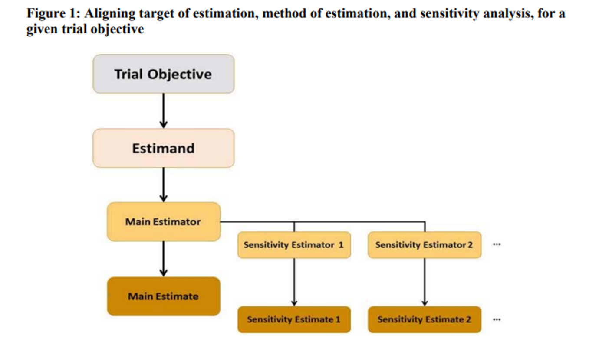

ICH E9(R1) 개정안은 임상시험 설계 및 분석 과정에서 발생할 수 있는 모호함을 해소하기 위해 구조화된 분석 체계(Estimand Framework)를 제시합니다 [@ich2019e9r1].

## 1. 개정안의 주요 목적 및 배경

임상시험에서 수집된 데이터를 단순히 분석하는 것만으로는 부족합니다. "치료 효과에 대해 무엇을 추정할 것인가?"라는 임상적 질문이 선행되어야 하며, 이를 명확히 하기 위해 Estimand의 개념이 도입되었습니다.

-   **핵심 이슈:**
    -   무작위 배정 이후 치료 과정을 변경하게 만드는 **중간 사건(Intercurrent Events, ICE)**에 대한 처리 방안.
    -   중도 탈락(Discontinuation)과 연구 동의 철회(Withdrawal)의 구분 및 관리.
    -   결과 데이터의 견고성(Robustness) 평가를 위한 민감도 분석 체계.

---

## 2. 임상시험의 분석 체계 (Framework)

임상시험의 기획 단계에서 다음의 연쇄적 과정을 거쳐야 합니다.

1.  **Estimand (분석 대상):** 특정 임상적 질문에 답하기 위해 추정하고자 하는 최종 목표 수치.
2.  **Estimator (추정 방법):** 정의된 Estimand를 산출하기 위한 구체적인 통계적 방법론.
3.  **Estimate (추정치):** 실제 수집된 데이터로부터 도출된 통계적 수치.
4.  **Sensitivity Analysis (민감도 분석):** 통계적 가정의 일관성과 결론의 정밀도를 검증하는 분석.

---

## 3. Estimand의 5가지 핵심 속성

관심 있는 치료 효과를 정밀하게 정의하기 위해 Estimand는 반드시 다음 속성들을 포함해야 합니다.

### (1) 치료 (Treatment)
평가 대상이 되는 치료법의 세부 내용 및 중간 사건 발생 시의 처치 규정.

### (2) 대상 집단 (Population)
임상적 질문이 적용될 모집단과 분석에 포함될 구체적인 피험자군.

### (3) 평가 변수 (Variable / Endpoint)
관심 있는 임상적 결과를 측정하는 구체적인 지표와 측정 시점.

### (4) 중간 사건(ICE) 처리 전략 (Strategies for ICEs)
ICE 발생 시 해당 데이터를 어떻게 처리할 것인가에 대한 전략.
-   **치료 방침 전략 (Treatment Policy):** ICE 발생과 무관하게 실제 측정된 모든 값을 있는 그대로 사용.
-   **가상적 전략 (Hypothetical):** "만약 특정 ICE가 발생하지 않았다면 어떤 결과가 나왔을까?"라는 가상적 상황 가정.
-   **복합 변수 전략 (Composite Variable):** ICE 자체를 평가 결과의 일부(예: 사망이나 탈락을 실패로 간주)로 통합.
-   **치료 중 전략 (While-on-Treatment):** ICE 발생 전까지만 측정된 데이터를 사용하여 분석.

### (5) 요약 지표 (Population-level Summary)
집단 간 치료 효과 차이를 설명하는 최종 요약 수치 (예: 평균 차이, 위험비(Hazard Ratio)).
