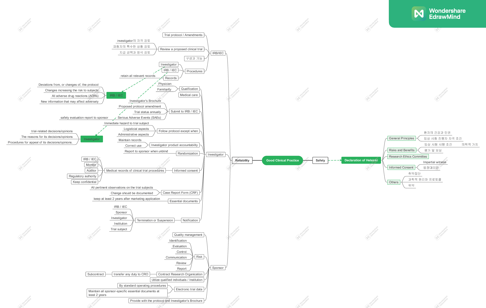

GCP(Good Clinical Practice)의 궁극적인 지향점은 **피험자의 권리와 인권 보호(Human Subject Protection)** 및 **임상 데이터의 과학적 신뢰성(Reliability of Results)** 확보에 있습니다 [@ich1996e6].

## 헬싱키 선언 (Declaration of Helsinki)

피험자 보호의 윤리적 근간은 세계의사협회(WMA)가 제정한 **헬싱키 선언**에 명시되어 있습니다 [@wma2013helsinki]. 다음은 GCP와 밀접하게 연계된 핵심 윤리적 원칙들입니다.

### 핵심 윤리 원칙 (Core Ethical Principles)

1.  **환자의 건강이 최우선:** 의사는 환자의 건강과 안녕을 최고의 가치로 삼아야 합니다.
2.  **존중과 보호:** 모든 연구는 피험자의 자율성을 존중하며, 발생 가능한 신체적·정신적 위험으로부터 그들을 보호해야 합니다.
3.  **과학적 지식보다 앞서는 권리:** 새로운 의학적 지식의 획득이라는 공익적 목적이 피험자의 권리와 복지보다 우선될 수 없습니다.
4.  **전문가에 의한 수행:** 모든 임상 연구는 적절한 교육과 검증을 거친 전문가 집단에 의해 수행되어야 합니다.

### 분석된 위험과 예상 이익 (Risks and Benefits)

- 모든 연구는 시작 전 예측 가능한 위험과 이익을 비교 평가해야 합니다.
- 피험자에게 가해지는 위험이 예상되는 이익보다 크거나, 이미 연구 가설에 대한 충분한 증거가 확보된 경우 연구를 즉시 수정하거나 중단해야 합니다.
- 연구 과정 중 피해를 입은 피험자에게는 적절한 보상과 치료가 제공될 수 있는 체계가 마련되어야 합니다.

### 취약한 피험자 보호 (Vulnerable Populations)

임상시험 중 추가적인 위험에 노출되기 쉽거나 자발적 의사 결정이 어려운 개인 및 집단을 **취약한 피험자(Vulnerable Subjects)**로 분류합니다. 이들을 대상으로 하는 연구는 비취약군으로는 연구 목적을 달성할 수 없는 경우에만 제한적으로 허용되며, 해당 집단의 건강상 유익이 명확해야 합니다.

---

## 임상시험의 거버넌스와 추진 체계

### 기관윤리심의위원회 (IRB / IEC)

IRB는 임상 연구의 윤리성과 과학적 타당성을 독립적으로 심의하는 기구입니다.

- **주요 책임:** 연구 계획서의 승인 및 검토를 통해 피험자의 안전과 권리를 실질적으로 보호합니다.
- **구성 요건:** 의학·과학 전문가뿐만 아니라 비과학 분야 위원 및 기관 외부 위원을 포함하여 최소 5인 이상으로 구성되어야 공정성을 확보할 수 있습니다.

### 책임 연구자 (Investigator)

- **자격:** 임상시험을 적절히 수행할 수 있는 전문적인 역량과 경험을 보유해야 합니다.
- **의료적 관리:** 시험 중 피험자에게 발생하는 모든 의료적 결정은 연구자의 전적인 책임하에 운영됩니다.
- **데이터 기록:** 증례 기록서(CRF)에 기록되는 모든 데이터는 근거 문서(Source Document)와 일치해야 하며, 수정 시에는 원본을 확인할 수 있는 감사 추적(Audit Trail)이 가능해야 합니다.

### 보고 체계와 안전 관리

- **중대한 이상사례(SAE):** 환자의 생명이나 안전에 직결되는 모든 중대한 이상사례는 규정된 절차에 따라 의뢰자(Sponsor)와 IRB에 즉시 보고해야 합니다.
- **투명한 진행:** 연구자는 시험의 진행 상태를 정기적으로 보고하고, 시험이 조기에 종료될 경우 모든 이해관계자에게 이를 투명하게 공지해야 합니다.
