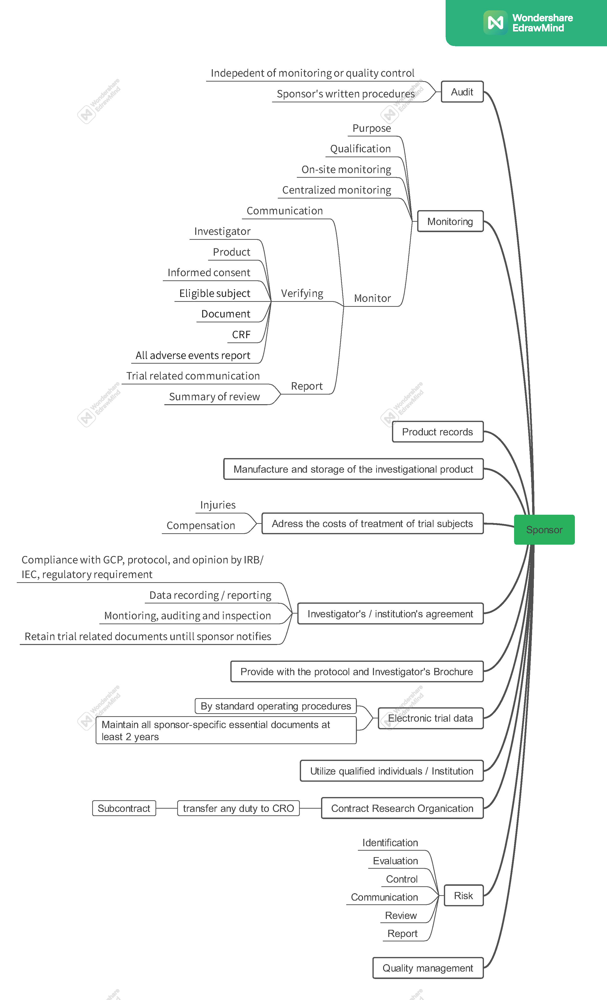

# 임상시험 관리 기준 (GCP) Part 1

GCP(Good Clinical Practice)의 목적은 크게 두 가지입니다. 첫째는 피험자를 보호하는 것(Human Subject Protection)이며, 둘째는 신뢰할 수 있는 임상시험 결과(Reliability of Trial Results)를 확보하는 것입니다 (ICH GCP 2.13).

피험자 보호의 기본 원칙은 [헬싱키 선언](https://www.wma.net/policies-post/wma-declaration-of-helsinki-ethical-principles-for-medical-research-involving-human-subjects/)에 기초합니다. 다음은 헬싱키 선언의 주요 내용 중 GCP와 밀접하게 연관된 핵심 사항들을 정리한 것입니다.

## 헬싱키 선언 (Declaration of Helsinki)

### 일반 원칙 (General Principles)

- 환자의 건강을 최우선으로 고려해야 합니다.
- 의학 연구는 피험자를 존중하고, 그들의 건강과 권리를 보호하는 범위 내에서 수행되어야 합니다.
- 의학 연구의 목적은 새로운 지식을 얻는 것이지만, 이러한 목적이 피험자의 권리와 이익보다 우선할 수 없습니다.
- 국가적 또는 국제적인 법적·규제적 요구사항이 헬싱키 선언에서 보장하는 피험자 보호 수준을 낮추거나 훼손해서는 안 됩니다.
- 피험자를 대상으로 하는 의학 연구는 적절한 윤리적·과학적 교육과 훈련을 받고 자격을 갖춘 전문가가 진행해야 합니다.

### 위험과 이익 (Risks and Benefits)

- 의학적 치료와 연구를 병행하는 경우, 잠재적인 예방·진단·치료적 가치가 있는 경우에만 정당화될 수 있습니다. 또한 의사는 환자의 건강에 부정적인 영향을 미치지 않을 것이라는 충분한 근거를 가지고 있어야 합니다.
- 연구 과정에서 피해를 입은 피험자에게는 적절한 보상과 치료가 보장되어야 합니다.
- 모든 의학 연구는 시작 전 피험자와 해당 집단에 대한 예측 가능한 위험과 이익을 비교 평가하는 과정을 반드시 거쳐야 합니다.
- 피험자에게 미치는 위험이 이익보다 크다고 판단되거나, 결과에 대한 결정적인 증거가 확보된 경우 의사는 해당 연구의 지속, 수정 또는 중단 여부를 즉시 평가해야 합니다.

### 취약한 집단 및 개인 (Vulnerable Groups and Individuals)

- 연구로 인해 추가적인 위험에 노출될 가능성이 높은 집단이나 개인을 '취약한 피험자(Vulnerable)'로 분류합니다.
- 이들은 특별한 보호를 받아야 합니다. 취약 집단을 대상으로 하는 연구는 비취약 집단을 대상으로 수행할 수 없는 경우에만 한하며, 해당 집단의 건강상 필요와 우선순위를 반영해야 합니다. 또한 연구 결과가 해당 집단에 실질적인 이익을 줄 수 있어야 합니다.

### 과학적 요구사항 및 연구 계획서 (Scientific Requirements and Research Protocols)

- 의학 연구는 일반적으로 인정된 과학적 원리에 기반해야 하며, 충분한 문헌 검토와 실험실 및 동물 실험 결과를 토대로 해야 합니다. 이때 실험 동물의 복지도 존중되어야 합니다.
- 연구 설계와 과정은 연구 계획서(Protocol)에 명확히 기술되어야 하며 정당성을 갖추어야 합니다.
    - **연구 계획서(Protocol):** 임상시험의 목적, 설계, 방법론, 통계적 고려사항 및 조직을 기술한 문서입니다. ICH GCP 가이드라인에서는 계획서뿐만 아니라 그 개정안(Protocol Amendments)도 포함하는 개념으로 사용됩니다.
- 계획서에는 윤리적 고려 사항과 헬싱키 선언의 원칙이 어떻게 적용되었는지 명시해야 합니다. 또한 자금 조달, 스폰서, 기관 제휴, 잠재적 이해상충, 피험자 인센티브, 피해 보상 및 치료에 대한 정보가 포함되어야 합니다.

### 연구 윤리 위원회 (Research Ethics Committees)

- 연구 계획서는 시작 전 심의와 승인을 위해 윤리 위원회(IRB/IEC)에 제출되어야 합니다. 위원회는 연구자 및 스폰서로부터 독립적이어야 하며 투명하게 운영되어야 합니다.
- 윤리 위원회의 승인 없이는 계획서를 임의로 변경할 수 없습니다. 연구 종료 후 연구자는 위원회에 최종 보고서를 제출해야 합니다.

### 사생활 보호 및 비밀 유지 (Privacy and Confidentiality)

- 피험자의 사생활을 보호하고 개인정보의 비밀을 철저히 준수해야 합니다.

### 충분한 정보에 의한 동의 (Informed Consent)

- 임상시험 참여는 피험자가 정보를 충분히 인지한 상태에서 자발적으로 동의(Informed Consent)했을 때만 가능합니다.
- 피험자는 연구의 목적, 방법, 자금 출처, 이해관계, 위험 및 이익, 참여 철회 권리 등을 충분히 설명 들어야 합니다.
- 동의는 원칙적으로 서면으로 이루어져야 합니다. 만약 서면 동의가 불가능한 경우, 독립적인 참관인(Impartial Witness)의 확인 하에 구두 동의 등의 절차를 문서화해야 합니다.
- 본인이 동의 능력이 없는 경우 법정 대리인으로부터 동의를 받아야 하며, 응급 상황 등 특수한 경우에 대한 절차는 계획서에 명시하고 윤리 위원회의 승인을 받아야 합니다.

### 위약의 사용 (Use of Placebo)

- 새로운 치료법의 효과는 입증된 최선의 방법과 비교되어야 합니다. 다만, 입증된 치료법이 없거나 과학적 타당성에 따라 위약(Placebo) 사용이 불가피한 경우에 한해 제한적으로 허용됩니다. 이 과정에서 피험자에게 심각하거나 돌이킬 수 없는 위해가 가해져서는 안 됩니다.

## 기타 안전 지침

- 임상시험용 의약품은 우수 의약품 제조 및 품질관리 기준(GMP)에 따라 제조, 관리 및 보관되어야 합니다.
- 피험자의 신원을 식별할 수 있는 정보는 철저히 보호되어야 합니다.

## 임상시험의 구조 및 주요 주체

### IRB / IEC (Institutional Review Board / Independent Ethics Committee)

의학, 과학, 비과학 분야의 위원들로 구성된 독립적인 기구로, 피험자의 권리, 안전, 복지를 보호할 책임이 있습니다. 연구 계획서 심의, 승인, 지속적인 검토 등을 수행합니다.

- **주요 기능:**
    - 연구자(Investigator)의 자격 검토
    - 취약한 피험자 보호 대책 확인
    - 피험자에게 제공되는 보상 및 지급 방법의 적절성 검토 (강압이나 부당한 영향 방지)
    - **구성:** 최소 5명 이상의 위원, 비과학 분야 위원 1명 이상, 기관 외부 위원 1명 이상 포함

### 연구자 (Investigator)

- **자격 및 책임:** 임상시험의 적절한 수행을 위한 교육, 훈련, 경험을 갖추어야 합니다. 계획서와 임상시험용 의약품에 대해 숙지하고, 참여 인력에게 충분한 정보를 제공해야 합니다.
- **의료적 관리:** 시험 중 발생하는 모든 의료적 결정은 자격을 갖춘 의사(또는 치과의사)가 책임집니다.
- **계획서 준수:** 스폰서의 합의와 IRB 승인 없이 계획서를 임의로 변경할 수 없습니다. (단, 피험자의 즉각적인 위험 제거가 필요한 경우는 예외)
- **의약품 관리:** 시험 사이트에서의 의약품 관리 책임은 연구자에게 있습니다. 배송, 재고, 투약, 반납 등 모든 과정을 정확히 기록해야 합니다.
- **동의 절차:** 피험자로부터 직접 동의를 받는 주체입니다. 이 과정에서 모니터 요원, 감사인, IRB, 규제 당국의 직접 접근 권한에 대해서도 설명해야 합니다.
- **증례 기록서 (CRF):** 스폰서에게 보고할 정보를 기록하는 문서로, 모든 데이터는 근거 문서(Source Documents)와 일치해야 하며 수정 시 감사 추적(Audit Trail)이 가능해야 합니다.

### 주요 보고 사항

- **이상반응 보고:** 모든 중대한 이상사례(SAE)는 스폰서에게 즉시 보고해야 합니다.
- **진행 상황 보고:** 연 1회 또는 IRB의 요청에 따라 시험 상태 요약 보고서를 제출해야 합니다.
- **조기 종료 시:** 시험이 중단되거나 조기 종료된 경우 피험자에게 알리고 적절한 사후 조치를 취해야 하며, IRB와 규제 당국에도 이를 보고해야 합니다.
