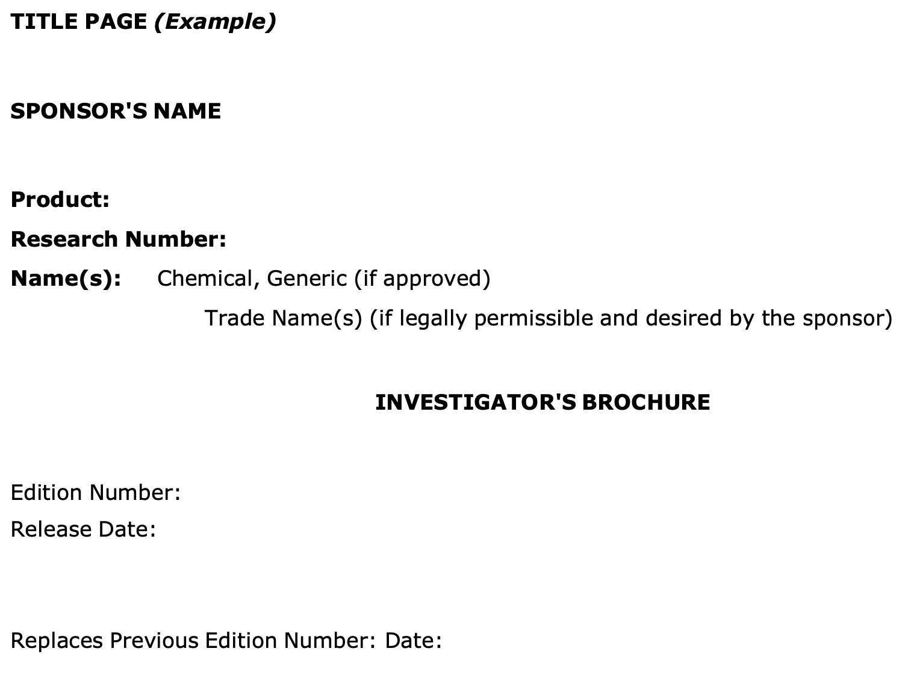
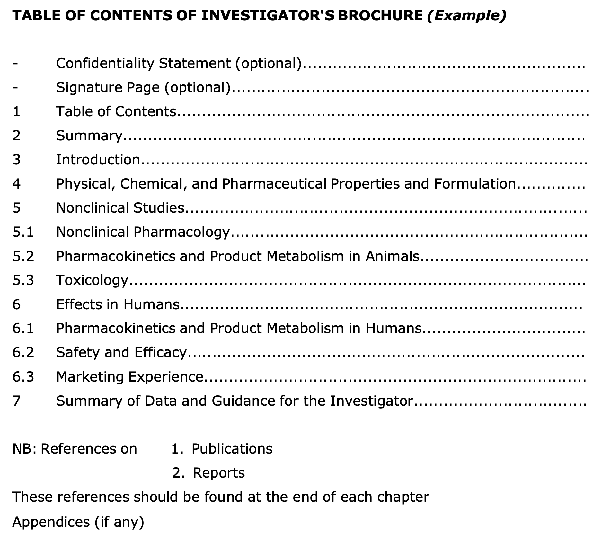

# 임상시험 관리 기준 (GCP) Part 2

## 6. 임상시험 계획서 및 개정안 (Protocol and Amendments)

임상시험 계획서의 내용은 일반적으로 다음과 같은 주제를 포함해야 합니다. 구체적인 정보는 별도의 계획서 페이지나 계약서에서 다루어질 수 있으며, 일부 정보는 연구자 자료집(IB) 등 다른 참조 문서에 포함될 수 있습니다.

### 6.1 일반 정보 (General Information)

계획서에는 다음과 같은 기본 정보가 포함되어야 합니다.

* 계획서 제목, 식별 번호, 날짜 및 개정 번호
* **주요 관련자 정보 (표 1 참고):**
    | 역할 | 성명 | 직함 | 주소 | 전화번호 |
    | :--- | :---: | :---: | :---: | :---: |
    | 의뢰자 (Sponsor) | O | X | O | X |
    | 모니터 (Monitor) | O | X | O | X |
    | 계획서 서명 권한자 | O | X | O | X |
    | 의뢰자 측 의료 전문가 | O | O | O | O |
    | 책임 연구자 (Investigator) | O | O | X | X |
    | 시험 실시기관 (Site) | X | X | O | O |
    | 의료 결정 책임 의사 | O | O | O | O |
    | 관련 실험실 및 기술 부서 | O | X | O | X |

    Table: 표 1. 계획서에 포함되는 주요 인력 정보 (O: 포함, X: 미포함)

### 6.2 배경 정보 (Background Information)

1. 임상시험용 의약품의 명칭 및 상세 설명
2. 비임상 연구 및 관련 임상시험 결과의 요약
3. 피험자에 대한 알려진 또는 잠재적 위험 및 이익 요약
4. 투여 경로, 용량, 투여 요법 및 치료 기간의 설명과 타당성 근거
5. 계획서, GCP 및 관련 규정 준수 확약
6. 대상 피험자군(모집단)에 대한 설명
7. 배경 근거가 되는 주요 문헌 및 데이터 목록

### 6.3 시험 목적 (Objectives and Purpose)

- 임상시험의 목적에 대한 상세한 설명

### 6.4 시험 설계 (Trial Design)

시험 데이터의 신뢰성은 설계의 과학적 무결성에 달려 있습니다.

1. 측정하고자 하는 일차 및 이차 평가변수 (Endpoints)
2. 시험 유형 및 설계에 대한 설명 (단계별 도식 포함)
3. 편향(Bias) 최소화 방법 (무작위 배정, 눈가림 등)
4. 시험 약물의 제형, 포장, 라벨링 및 투여 방법 설명
5. 피험자별 예상 참여 기간 및 전체 시험 일정
6. 시험 중단 기준 (개별 피험자 및 전체 시험)
7. 위약 및 대조약 관리 절차
8. 무작위 배정 코드 관리 및 긴급 해제 절차
9. 증례 기록서(CRF)에 직접 기록되는 원시 데이터(Source Data)의 정의

### 6.5 피험자 선정 및 탈락 (Selection and Withdrawal)

* 피험자 선정 기준 (Inclusion Criteria)
* 피험자 제외 기준 (Exclusion Criteria)
* 피험자 중도 탈락 기준 및 관련 절차:
    1. 탈락 시점 및 방법
    2. 탈락 피험자로부터 수집할 데이터의 유형과 시기
    3. 피험자 교체 여부 및 방법
    4. 탈락 피험자에 대한 후속 조치

### 6.6 피험자 치료 (Treatment of Subjects)

1. 투여되는 모든 약물의 명칭, 용량, 투여 경로 및 기간
2. 시험 전후 및 기간 동안 허용되거나 금지되는 병용 약물
3. 피험자의 복약 순응도(Compliance) 확인 방법

### 6.7 유효성 평가 (Assessment of Efficacy)

1. 유효성 평가변수 설정
2. 평가변수의 측정, 기록 및 분석 방법과 시기

### 6.8 안전성 평가 (Assessment of Safety)

1. 안전성 평가변수 명세
2. 평가변수의 측정, 기록 및 분석 방법과 시기
3. 이상사례(AE) 및 병발 질환의 보고 및 기록 절차
4. 이상사례 발생 후 피험자 추적 관찰 기간 및 방법

### 6.9 통계 (Statistics)

1. 중간 분석 시기를 포함한 통계적 방법 설명
2. 계획된 피험자 수 (다기관 시험의 경우 기관별 예상 인원)
3. 표본 크기(Sample Size) 산출 근거 (검정력 및 임상적 타당성)
4. 사용할 유의 수준 (Significance Level)
5. 시험 종료 기준 (Termination Criteria)
6. 결측치(Missing Data) 및 이상치 처리 절차
7. 통계 계획 변경 시 보고 및 정당화 절차
8. 분석 대상군 설정 (예: ITT, PP 등)

### 6.10 원시 데이터 접근 (Direct Access to Source Data)

의뢰자는 연구자 및 실시기관이 모니터링, 감사, IRB 심의 및 규제 기관의 조사를 위해 원시 데이터와 문서에 직접 접근하는 것을 허용하도록 보장해야 합니다.

### 6.11 품질 관리 및 보증 (QC & QA)

### 6.12 윤리적 고려 사항 (Ethics)

### 6.13 데이터 처리 및 기록 보관 (Data Handling & Record Keeping)

### 6.14 재정 및 보험 (Financing and Insurance)

### 6.15 출판 정책 (Publication Policy)

---

## 7. 연구자 자료집 (Investigator’s Brochure, IB)

**연구자 자료집(IB)은 피험자를 대상으로 하는 임상시험용 의약품과 관련된 임상 및 비임상 데이터의 편집본입니다.**

- **목적:** 연구자가 계획서의 핵심 내용(용량, 투여 경로, 안전성 모니터링 등)을 이해하고 준수할 수 있도록 과학적 근거를 제공하는 것입니다.
- **특징:** 정보는 간결하고 객관적이어야 하며, 편향되지 않은 위험-이득 평가가 가능하도록 비홍보적 형식으로 작성되어야 합니다.
- **관리:** 최소 매년 1회 검토되어야 하며, 새로운 중요한 정보가 발생할 경우 수시로 업데이트되어야 합니다. 의뢰자는 최신 IB를 연구자에게 제공할 책임이 있습니다.

### 7.2 IB의 주요 내용

1. **요약 (Summary):** 물리적, 화학적, 약학적, 약리학적, 독성학적, 약물동태학적, 대사 및 임상적 정보의 핵심 요약
2. **서론 (Introduction):** 약물 명칭, 활성 성분, 약리학적 분류, 연구 근거 및 예상 적응증
3. **물리·화학·약학적 특성:** 제형 및 성분 설명, 보관 및 취급 방법
4. **비임상 연구 (Nonclinical Studies):** 동물 대상 약리학, 독성학, 약물동태학 결과 요약
5. **임상 연구 (Effects in Humans):** 인간 대상 약물동태학, 안전성, 유효성 및 시판 경험(있는 경우) 정보
6. **데이터 요약 및 연구자 지침:** 전체 데이터를 종합적으로 논의하여 연구자가 이상반응 등을 예측하고 대비할 수 있도록 가이드 제공

### 7.4 부록 1: IB 표지 예시

### 7.5 부록 2: IB 목차 예시

---

## 8. 임상시험 수행을 위한 필수 문서 (Essential Documents)

필수 문서는 임상시험의 수행 과정과 데이터의 품질을 증명하는 중요한 서류들입니다.

| 번호 | 문서명 | 시작 전 | 진행 중 | 종료 후 |
| :--: | :--- | :---: | :---: | :---: |
| 1 | 연구자 자료집 (IB) | O | 업데이트 | X |
| 2 | 서명된 계획서 및 개정안, CRF 양식 | O | X | X |
| 3 | 피험자용 설명서 및 동의서 | O | X | X |
| 4 | 재정적 합의 사항 | O | X | X |
| 5 | 보험 증명서 | O | X | X |
| 6 | 관련 당사자 간 서명된 합의서 | O | X | X |
| 7 | IRB/IEC 승인 서류 | O | 수정 시 | X |
| 8 | IRB/IEC 명단 | O | X | X |
| 9 | 규제 당국 승인/신고서 | O | O | X |
| 10 | 연구자 및 공동연구자 이력서 | O | O | X |
| 11 | 검사 수치 정상 범위 (Normal Ranges) | O | 업데이트 | X |
| 12 | 의료/기술적 검사 절차 및 유효성 증명 | O | 업데이트 | X |
| 13 | 시험 약물 라벨 샘플 | O | X | X |
| 14 | 약물 관리 및 취급 지침서 | O | X | X |
| 15 | 시험 약물 배송 기록 | O | 문서화 | X |
| 16 | 시험 약물 분석 증명서 (CoA) | O | O | X |
| 17 | 눈가림 해제 절차 (Blind Test용) | O | X | X |
| 18 | 마스터 무작위 배정 명부 | O | X | X |
| 19 | 시험 전 모니터링 보고서 | O | X | X |
| 20 | 시험 개시 모니터링 보고서 | O | X | X |
| 21 | 모니터링 방문 보고서 | X | O | X |
| 22 | 주요 서신 (방문 외 통신) | X | O | X |
| 23 | 서명된 피험자 동의서 원본 | X | O | X |
| 24 | 원시 문서 (Source Documents) | X | O | X |
| 25 | 작성 완료된 증례 기록서 (CRF) | X | O | X |
| 26 | CRF 수정 증빙 자료 | X | O | X |
| 27 | 중대한 이상사례 (SAE) 보고서 | X | O | X |
| 28 | 예상치 못한 중대한 약물유해반응 보고 | X | O | X |
| 29 | 안전성 정보 통지서 | X | O | X |
| 30 | IRB 중간 또는 연례 보고서 | X | O | X |
| 31 | 피험자 스크리닝 명부 | X | O | X |
| 32 | 피험자 식별 코드 명부 | X | O | 완료 |
| 33 | 피험자 등록 명부 (Enrolment Log) | X | O | X |
| 34 | 시험 사이트 약물 수불부 | X | O | O |
| 35 | 서명 권한 위임 명부 (Signature Sheet) | X | O | X |
| 36 | 검체 보관 기록 (해당 시) | X | O | X |
| 37 | 시험 약물 폐기 증빙 문서 | X | X | O |
| 38 | 감사 증명서 (있는 경우) | X | X | O |
| 39 | 시험 종료 모니터링 보고서 | X | X | O |
| 40 | 배정 및 해제 관련 최종 문서 | X | X | O |
| 41 | 연구자 최종 보고서 (IRB 제출용) | X | X | O |
| 42 | 최종 임상시험 결과 보고서 (CSR) | X | X | O |

Table: 표 2. 임상시험 단계별 필수 문서 리스트

---
## 참고 문헌
* [ICH Guideline for Good Clinical Practice E6(R2)](https://www.ema.europa.eu/en/documents/scientific-guideline/ich-guideline-good-clinical-practice-e6r2-step-5_en.pdf)
