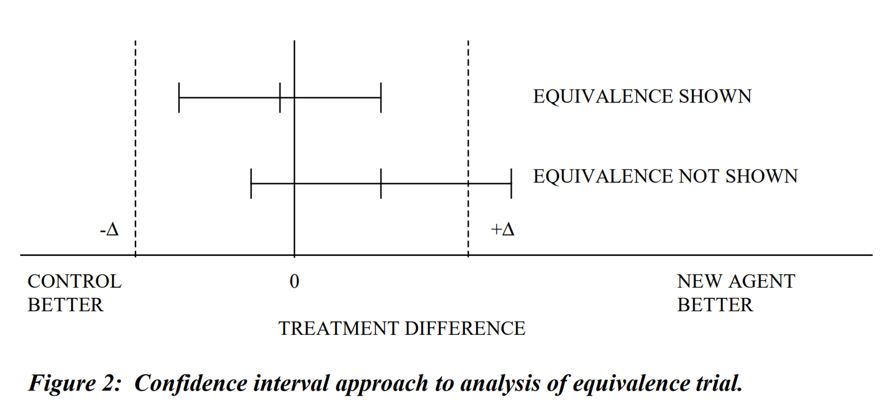
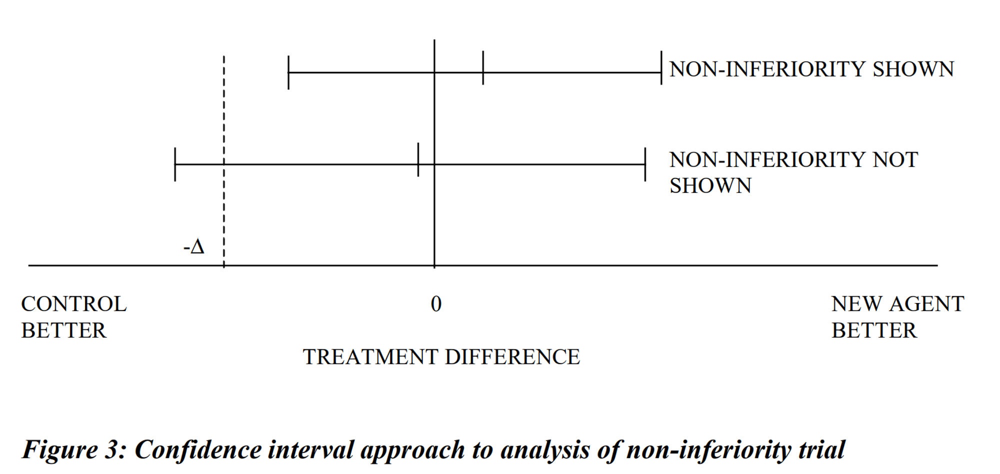
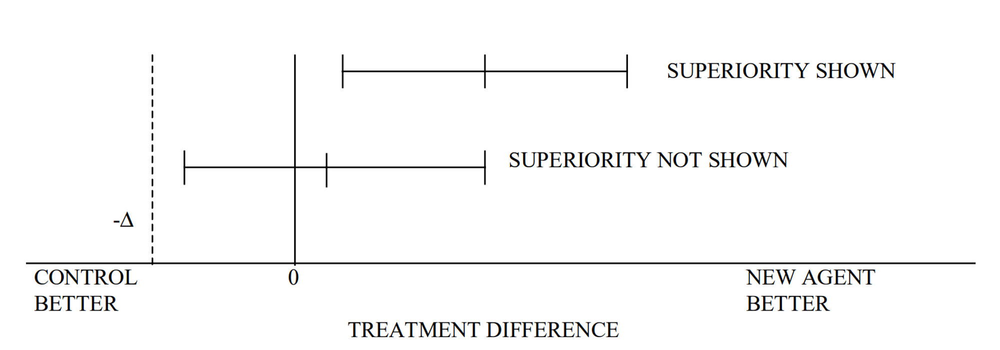
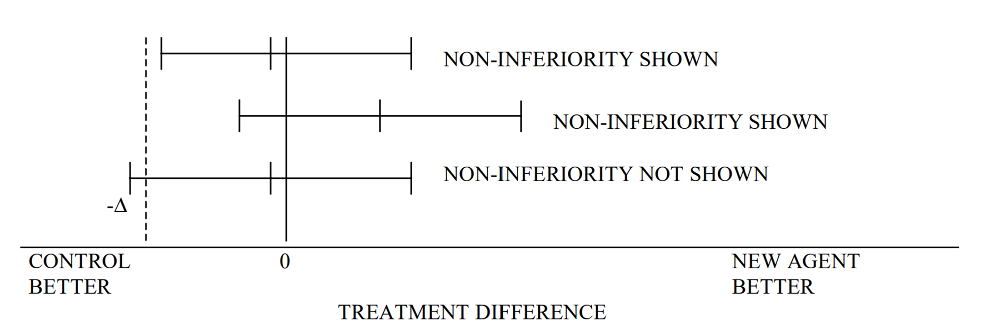

# 우월성 및 비열등성 시험 간의 전환 시 고려사항

## 1. 서론 (Introduction)

### 시험군(신약)과 활성 대조군 간의 비교 유형

임상시험에서 신약의 유효성을 검증하기 위한 비교 유형은 크게 세 가지로 나뉩니다.

- **우월성 (Superiority):** 신약이 대조군보다 뛰어남을 입증
- **비열등성 (Non-inferiority):** 신약이 대조군보다 크게 나쁘지 않음을 입증
- **동등성 (Equivalence):** 신약과 대조군의 효과 차이가 허용 범위 내에 있음을 입증

### 비교 유형 간의 전환

상황에 따라 초기 설정한 비교 목적을 다음과 같이 전환해야 할 경우가 발생합니다.

- 우월성 시험 → 비열등성 시험으로 해석
- 비열등성 시험 → 우월성 시험으로 해석
- 동등성 시험 → 더 좁은 마진의 동등성 확인

본 문서는 단일 일차 평가변수를 사용하는 유효성 시험의 관점에서, 이러한 전환 시 고려해야 할 통계적·임상적 원칙을 다룹니다.

## 2. 시험 목적별 비교 (Trial Objectives)

| 비교 유형 | 우월성 시험 (Superiority) | 동등성 시험 (Equivalence) | 비열등성 시험 (Non-inferiority) |
| :--- | :--- | :--- | :--- |
| **목적** | 시험약이 대조약보다 임상적으로 우월함을 확인 | 두 치료군 간의 효과 차이가 임상적으로 유의하지 않음을 확인 | 시험약이 대조약보다 효과가 작지 않음(비열등함)을 확인 |
| **검정 방법** | 주로 p-value 확인 (p < 0.05) | 주로 신뢰구간(CI) 사용 | 주로 신뢰구간(CI) 및 하한선 확인 |
| **신뢰구간 및 허용 한계(Δ)** | 95% 신뢰구간이 0을 포함하지 않아야 함. 별도의 허용 한계(Δ)는 없음. | 95% 신뢰구간이 (-Δ, +Δ) 사이에 완전히 포함되어야 함. | 95% 신뢰구간의 하한값이 -Δ보다 오른쪽에 있어야 함. |

### 시각적 비교

- **신뢰구간:** 95% 양측 신뢰구간 기준
- **좌측:** 대조군 효과 우세 / **우측:** 시험군 효과 우세 ($\mu_T - \mu_C$)
- **Δ (Delta):** 임상적으로 허용 가능한 최대 차이값 (마진)

## 3. 사전 정의의 중요성

시험 설계 단계에서 다음 사항들이 사전에 정의되어야 합니다.

- 대조군의 치료법, 용량, 대상자 및 평가변수의 적절성
- 통계적 검정력에 근거한 표본 크기 산출
- 비열등성 및 동등성 마진(Δ)의 설정 근거
- 프로토콜 내 명확한 통계 분석 계획
- 시험의 민감도(Sensitivity) 확보 여부

## 4. 비교 목적의 전환 (Switching the Objective)

### 4.1 비열등성 시험을 우월성 시험으로 해석하는 경우

이 전환은 통계적으로 **폐쇄 검정 절차(Closed Test Procedure)**에 해당하므로, 별도의 다중성 조절 없이도 제1종 오류(Type 1 Error)를 제어할 수 있습니다.

- **대조군의 적절성:** 대조군이 해당 적응증에서 유효성이 확립된 약제여야 하며, '우월성'에 대한 기준이 명확해야 합니다.
- **검정력:** 비열등성 시험은 대조군과의 작은 차이도 정밀하게 보기 위해 대규모로 설계되는 경우가 많아, 우월성을 입증하기에 충분한 정밀도를 가질 수 있습니다.
- **분석 집단:** 우월성 입증을 위해서는 **ITT 원칙에 따른 FAS(Full Analysis Set)** 분석 결과가 핵심적인 역할을 합니다.
- **신뢰도:** 비열등성 시험에서 우월성이 입증되면 시험의 민감도가 함께 증명되는 셈이므로 결론의 신뢰도가 높아집니다.

### 4.2 우월성 시험을 비열등성 시험으로 해석하는 경우

우월성 입증에 실패한 후 비열등성을 주장하려는 경우로, 4.1의 경우보다 훨씬 엄격한 기준이 적용됩니다.

- **마진(Δ)의 사후 설정 문제:** 시험 종료 후 마진을 설정하는 것은 분석자의 주관이 개입될 수 있어 편향의 위험이 큽니다. 가급적 설계 단계에서 마진을 사전에 정의해두는 것이 좋습니다.
- **시험의 민감도:** 우월성 시험은 차이를 입증하지 못했을 때 그것이 실제 효과가 없어서인지, 아니면 시험의 정밀도(민감도)가 낮아서인지를 구별하기 어렵습니다. 따라서 비열등성을 주장하기 위해서는 해당 시험이 효과 차이를 감별해낼 충분한 민감도를 가졌음을 입증해야 합니다.
- **분석 집단:** 비열등성 판단 시에는 **FAS와 PP(Per Protocol) 집단 모두에서 일관된 결과**가 나오는지 확인하는 것이 매우 중요합니다.

## 5. 결론 및 제언

우월성 시험과 비열등성 시험 간의 전환은 결과를 **신뢰구간(Confidence Interval)** 관점에서 접근할 때 가장 명확하게 해석될 수 있습니다.

1.  **비열등성 → 우월성:** 적절히 설계된 시험이라면 전환에 큰 무리가 없으며, 결론의 신뢰성을 높여줍니다.
2.  **우월성 → 비열등성:** 사후에 마진을 설정해야 하는 어려움과 시험의 민감도 부족 가능성 때문에 신중해야 합니다. 가급적 설계 단계에서 비열등성 마진을 함께 고려하는 것이 바람직합니다.

결국, 가장 좋은 방법은 시험 설계 단계에서 비열등성과 우월성을 모두 순차적으로 검정할 수 있도록 **전향적인 분석 계획**을 수립하는 것입니다.
