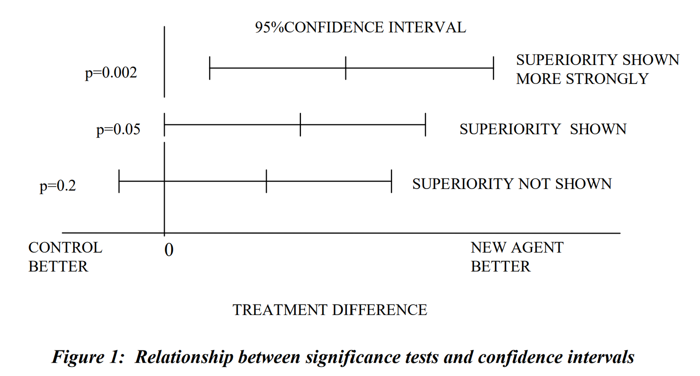

임상 연구의 설계 단계에서 설정한 비교 목적(예: 우월성 시험)을 연구 결과에 따라 다른 관점(예: 비열등성)에서 재정의할 때 발생하는 통계적·임상적 원칙을 다룹니다.

## 1. 임상시험의 비교 유형

-   **우월성 (Superiority):** 시험약이 대조군보다 통계적으로 유의하고 임상적으로 유미한 우위에 있음을 입증합니다.
-   **비열등성 (Non-inferiority):** 시험약과 대조약 간의 차이가 사전에 설정한 허용 범위(Margin) 내에 있음을 입증합니다.
-   **동등성 (Equivalence):** 두 치료군 간의 효과 차이가 임상적으로 무시할 수 있는 수준임을 입증합니다.

---

## 2. 비교 목적의 시각적 이해

치료 효과의 차이는 주로 95% 신뢰구간(Confidence Interval)을 통해 판단합니다.

-   **Δ (Delta):** 임상적으로 수용 가능한 최대 차이값(마진).
-   **$\mu_T - \mu_C$:** 시험군과 대조군 간의 평균 효과 차이.

---

## 3. 비교 목적의 전환 (Switching)

### 비열등성 시험 → 우월성 시험으로의 해석

이 경우에는 통계적으로 **폐쇄 검정 절차(Closed Test Procedure)**의 틀 내에서 작동하므로, 별도의 다중성 보정 없이도 제1종 오류 제어가 가능합니다.

-   **신뢰구간 확인:** 비열등성 마진을 만족하는 동시에, 신뢰구간의 하한값이 0보다 큰 경우 우월성을 입증한 것으로 간주할 수 있습니다.
-   **분석 집단:** ITT 원칙에 기반한 FAS 분석이 주요 근거가 됩니다.

### 우월성 시험 → 비열등성 시험으로의 해석

우월성 검정에 실패한 후 비열등성을 주장하는 경우로, 훨씬 엄격한 검토가 필요합니다.

-   **마진(Δ)의 사전 정의:** 시험 종료 후 사후적으로 마진을 설정하는 것은 분석자의 주관이 개입될 수 있어 편향의 위험이 큽니다. 가급적 프로토콜 단계에서 사전에 정의되어야 합니다.
-   **검정의 민감도:** 해당 시험이 실제 차이를 식별해낼 수 있는 충분한 민감도를 가지고 수행되었는지(예: 대조군의 유효성 유지) 성립해야 합니다.
-   **일관된 결과:** FAS와 PPS 집단 모두에서 비열등성 마진을 만족하는 일치된 결과가 권장됩니다.

---

## 4. 실무적 권고 사항

가장 바람직한 접근법은 연구 설계 단계에서 우월성과 비열등성을 동시에 고려하여, 순차적 검정(Sequential Testing) 체계를 수립함으로써 사후 해석의 논란을 최소화하는 것입니다.
